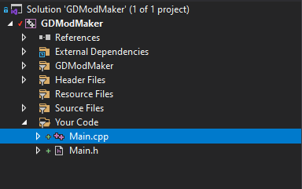

# GeometryDashModMaker
A thing that helps you make mods for Geometry Dash in c++

# Warning
This is currently in developement and cannot yet be used to do alot ;)

# Installation
To make your Geometry Dash mod with this you must copy the source code into a folder. There are 2 ways of doing.

## Git Cloning (Recommended)

1. Go ahead and [Download Git](https://git-scm.com/download/win)
2. Install it
3. Create a new folder (This will hold your mod code)
4. Open a command prompt and cd into that directory (EG. "cd C:\Users\Decoder\Desktop\GDModMaker"
5. Enter the command `git clone "https://github.com/decoder0007/GeometryDashModMaker.git"`

## Downloading the zip (Not Recommended)

1. Click the green `Code` button
2. Click download zip
3. Extract the zip file
4. Rename folder to your project name
5. Move the folder to wherever

## Usage

If you download it as of now you will find a simple project that has been setup for you

All you need to worry about is the Main.cpp

As you can see in the RunMod() function there is `GDModMaker::HookMenuLayer();`
This connects your mod to the Main Menu page in the game!
Above the RunMod() function you will find a large section called `GDModMaker::MenuLayerCode()`
When you run `GDModMaker::HookMenuLayer();` as mentioned before it will run all of the code in the `GDModMaker::MenuLayerCode()` function.
Under the conveniently labeled `Your code goes here` section, you will find 3 similar lines of code.
`GDModMaker::CreateSpriteToLayer(100, 100, "difficulty_10_btn2_001.png", self);`
This line of code creates a sprite:
* With an X Position of 100
* With a Y Position of 100
* Using the "difficulty_10_btn2_001.png" texture (The extreme demon icon)
* On the layer self which in `GDModMaker::MenuLayerCode()` means the MenuLayer

# Todo list

[x] Hooking MenuLayer
[ ] Hooking PlayLayer
[ ] Hooking PauseLayer
[ ] Hooking Literally every other layer

[x] Create Sprite
[x] Create Sprite to a Layer
[ ] Fade a node in (WIP)
[ ] Fade a node out (WIP)

[ ] Other cool functions